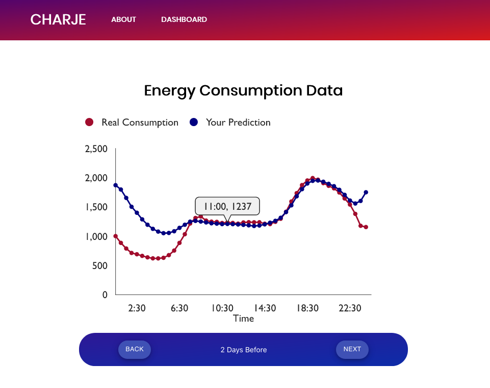

# CO362 Group 1 (CHARJE)

Software Engineering Project for Group 1:
Crowd-sourcing agent-based machine learning algorithms using prediction marketplaces implemented on a blockchain

This project is built for the CO362 Software Engineering Project module taken by 3rd year Imperial College London Computing/JMC students.

## Background
Everyday, energy retailers face the challenge of purchasing an optimal amount of energy from energy wholesalers.
They often experience a loss because they cannot estimate the energy demand accurately. There are currently
around 25 billion Internet of Things (IoT) devices worldwide. Over the next 5 years, that number is expected
to increase to over 75 billion. Some of these devices collect a lot of data including the household energy
consumption. This data is currently unused but could be extremely valuable in forming a more accurate
prediction of future energy consumption.

## Our Project
Our project sets up a prediction marketplace on a blockchain, on which people across the country can bet their prediction of tomorrow’s national energy consumption, monetising their IoT data. It aims to serve energy retailers and interested betting parties including households with IoT energy data.

Our prediction market is decentralised and implemented on a blockchain, which ensures data integrity. It is accompanied by a decentralised web application to visualise the prediction market. We created intelligent
autonomous agents that can be run continuously to participate in the prediction marketplace on behalf of the
household, mimicking how we envision agents to interact with the prediction market in the real world. These
agents make intelligent decisions based on recent national energy consumption and/or private household energy
consumption data.

Our agents use various machine learning models such as autoregression, long short-term memory (LSTM) and
random forest regressors and we evaluated their performance and suitability for the problem at hand. In addition
we came up with a few other strategies that the agents could employ.

The below simplified system architecture diagram gives a good overview of our solution:

## Prediction Market
The prediction market is essentially an Ethereum smart contract. A smart contract is simply a piece of code which self-executes on a blockchain.

The prediction market we have implemented is built to collect tomorrow's energy demand predictions. Betting participants
can place a bet and make a prediction (48 data points for 48 30-minute time periods), rank how well they have done,
and claim their rewards. The betting process is outlined in the diagram below:

To compile and deploy the prediction market smart contract, see [`prediction-market/README.md`](prediction-market/README.md)

## Agents
Our autonomous agents are implemented in Python, and use various machine learning models (Autoregression, LSTM, Random Forest, etc.) and strategies to make their predictions.

We have made a nice step-through and realtime demo for you to play around with.

More instructions on the agents and running the demo can be found in [`agent/README.md`](agent/README.md)

## Decentralised Webapp (DApp)

We also created a DApp with a React frontend and Drizzle to interact with the smart contract. The DApp helps visualise
the prediction market in the energy retailer's perspective and the betting participant's (agent) perspective.

You can visit the publicly deployed DApp (you need to install [Metamask](metamask.io)) at charje-software.github.io. 
The DApp currently interacts with a prediction market smart contract that we deployed on Ropsten (an Ethereum testing network).

See more on running the DApp locally in [`prediction-market/app/README.md`](prediction-market/app/README.md)

## Acknowledgements
We would like to thank Dominik Harz for supervising this project and for his valuable guidance with blockchain
technologies and development.

We would also like to thank FetchAI (Kevin, Jon, Yujian, Daniel) for their helpful insights regarding prediction
markets, energy markets, ML models, and developing a decentralised platform.

##### Authors: Ashly Lau, Christopher Gunadi, Esther Wong, Hannah Schlueter, Jasmine Quah, Ram Popat
